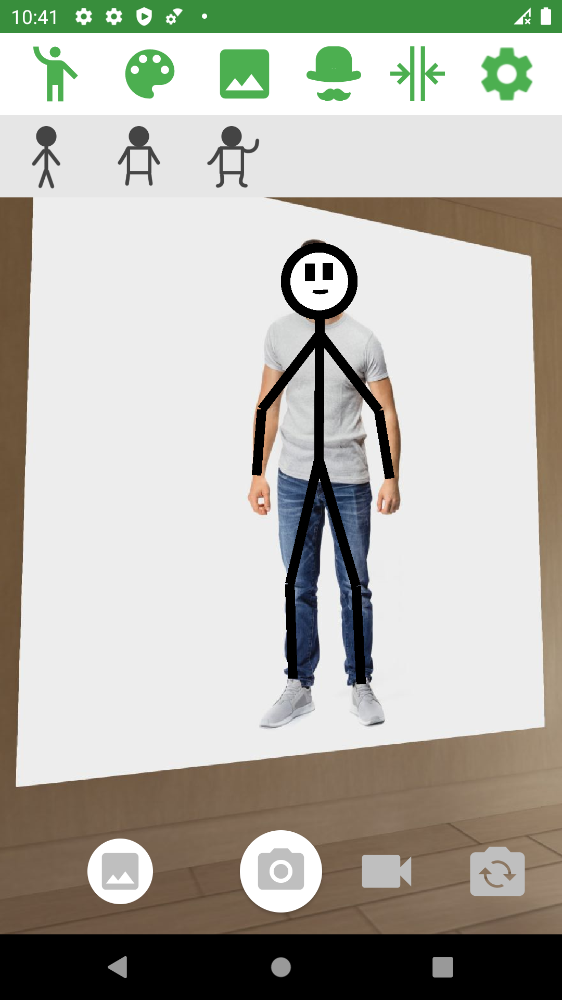
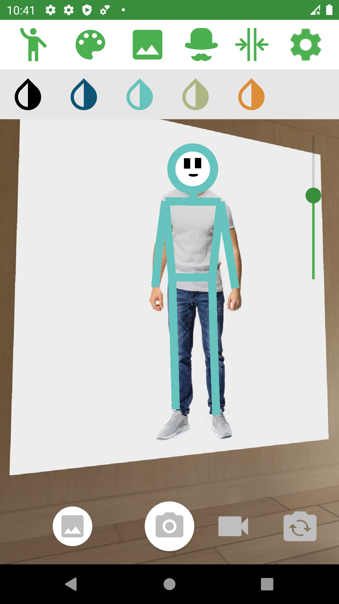
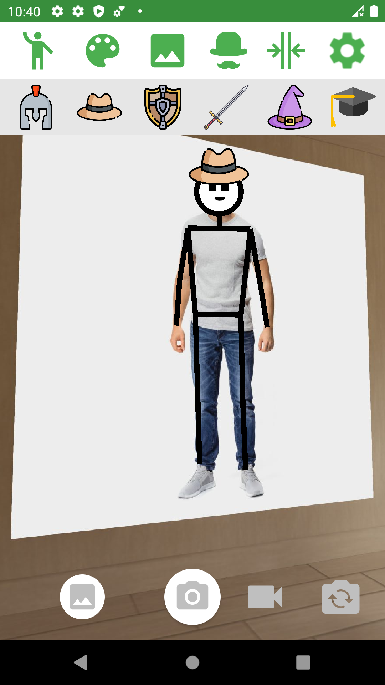
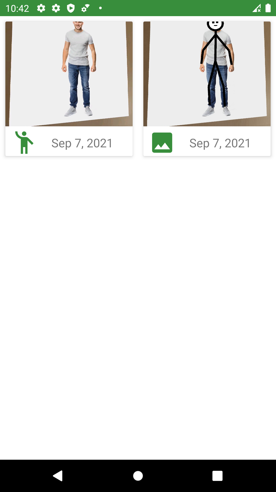
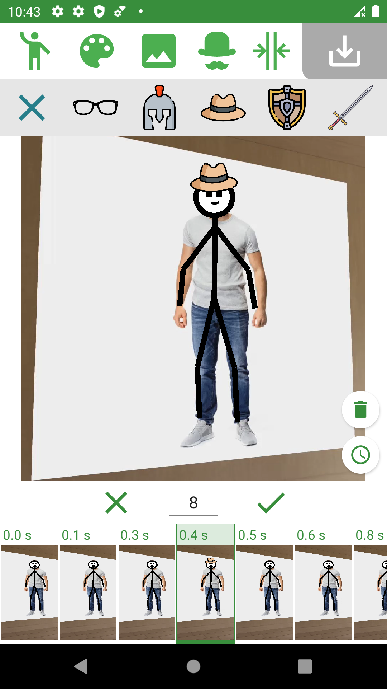
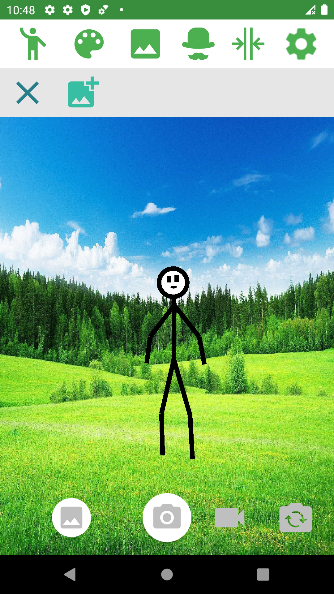

# Stickman

### Mobile application that turns a person into a customizable cartoonish figure in real-time.

The goal of this project is to create mobile application for Android that allows users to turn themselves into a stickman.

The application allows the processing of a real image of a person from the camera into a cartoon image of a person, for example in the form of a stickman. 
The application is to serve in a similar way to the camera filter. The coordinates of the person's pose captured with the camera are used to draw the cartoonish figure in real-time, so that the app user can see himself as a dynamic drawing. Only the coordinates of the person are used from the real image and the background behind the person is not displayed. However, the user is able to choose the image displayed in the background, thanks to which the displayed character is placed in the selected scenery. While previewing his drawing in real time, the user is able to save a snapshot of the current image. 

As part of the application, the Google ML Kit tool is used. Google ML Kit allows one to detect human figures in real time using artificial intelligence. This tool does not require an internet connection as the detection takes place directly on the device, allowing the user to use the application without a network connection. 

## Getting Started

### Prerequisites

* Android SDK
* Android Studio - https://developer.android.com/studio/

Detailed information about installation and configurations are provided at developers' site.

## Technology Stack

* Android
* Java
* ML Kit Pose Detection API - https://developers.google.com/ml-kit

## Preview

<table>
    <tr>
        <td>
            
Figure Selection

            
        </td>
        <td>
            
Brush Size Selection

            
        </td>
        <td>
            
Accesory Selection

            
        </td>
    </tr>
    <tr>
        <td>
            
Photos and Videos Listing

            
        </td>
        <td>
            
Video Editor

            
        </td>
        <td>
            
Background Selection

            
        </td>
    </tr>
</table>

## Authors

* **Michał Koziara** 
* **Karina Litwynenko**
